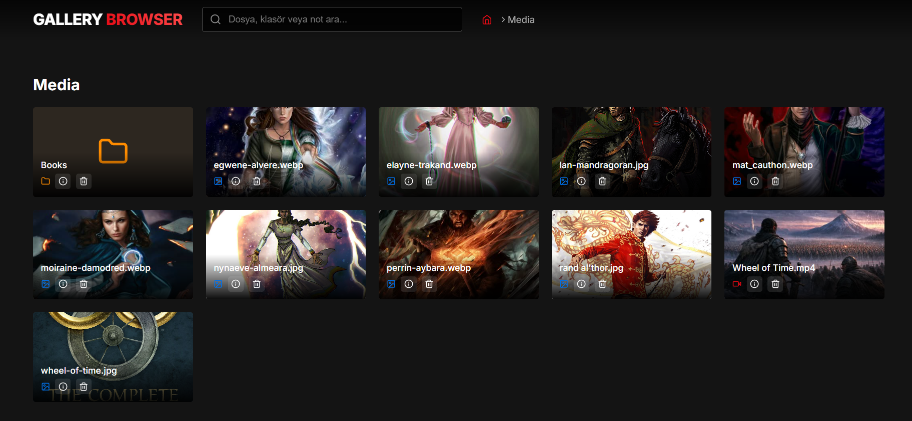

# Gallery Browser 🎬



Gallery Browser is a fast and stylish media gallery application that allows you to browse, view, and manage your local media collection (images and videos).

---

## 🚀 Features

- **Theme:** Modern, fast, and user-friendly UI.
- **Smart Media Viewer:**
  - Zoom with mouse wheel.
  - **Pan with Right-Click + Drag.**
  - Single-click play/pause.
  - Seamless playback in zoom mode.
- **File Management:** Support for deleting files and adding custom notes/info for each file.
- **Advanced Search:** Quick search across all folders.
- **Multi-Language Support:** Turkish and English support.
- **Full Screen:** Immersive full-screen viewing experience.
- **Keyboard Controls:** Easy navigation with Page (Up/Down) and Arrow keys.

---

## 🆕 v1.0.1 Changelog
- **Modern UI:** Added glassmorphism effect to the navbar.
- **Form Improvements:** Optimized form elements for light and dark themes.
- **Notification System:** Replaced browser alerts with elegant toast notifications.
- **Enhanced Footer:** Added developer info and GitHub repository link.
- **Video Controls:** Fixed issue where video controls (volume, fullscreen, etc.) were unreachable in zoom mode.
- **Navigation:** Added PageUp and PageDown key support for switching media.

---

## 🆕 v1.0.2 Changelog
- **Image Editor:** Added Crop and Rotate features for images.
- **Direct Save:** Edited images are saved directly over the original file, and the gallery updates instantly.
- **Bug Fixes:** Resolved import issues and CORS errors with the Cropperjs library.
- **Multi-Language:** Added Turkish and English translations for new features.

---

## 📦 Getting Started

### Quick Start (Windows)
1. Ensure you have the project files.
2. Run `GalleryLauncher.exe`. This will automatically start the server and open the browser for you.
3. Configure your media paths in `config.ini` if necessary.

### Manual Installation (Development)
1. **Prerequisites:** Node.js (v16 or higher) must be installed.
2. **Install Dependencies:**
   ```bash
   npm install
   ```
3. **Start the App:**
   - For development:
     ```bash
     npm run dev
     ```
   - To start the server manually:
     ```bash
     node server.js
     ```

---

## ⚙️ Configuration
You can customize the library path and settings in the `config.ini` file:
```ini
[Settings]
LibraryPath=C:/Your/Media/Path
Language=en
AutoPlay=true
```

---

## 🛠️ Usage Controls

| Action | Control |
| :--- | :--- |
| **Play / Pause** | Left Click |
| **Zoom In / Out** | Mouse Wheel |
| **Panning** | Right-Click + Drag |
| **Reset Zoom** | Right Click (Single) |
| **Next / Prev Media** | PageDown / PageUp or Arrows |
| **Close** | ESC or X button |
