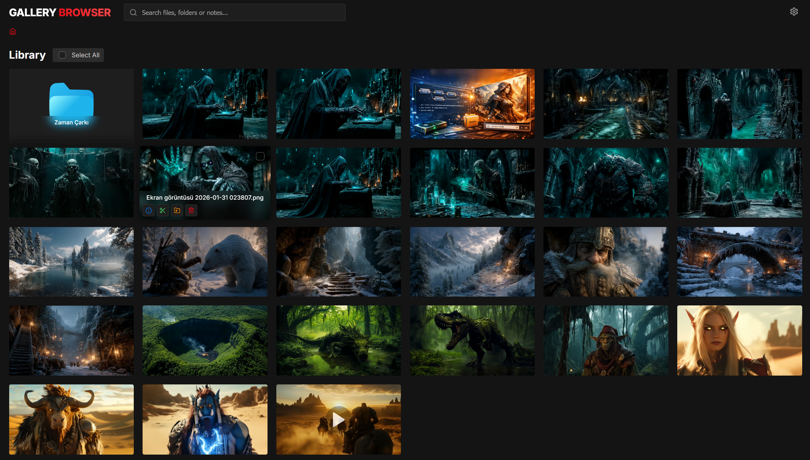
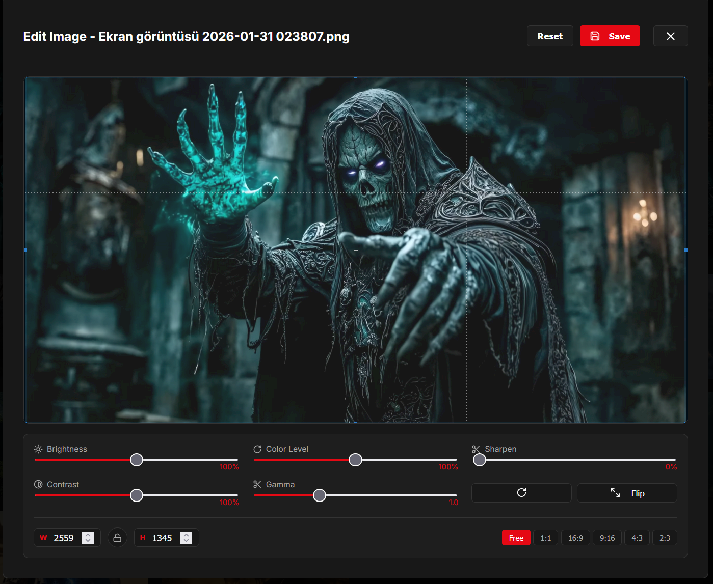
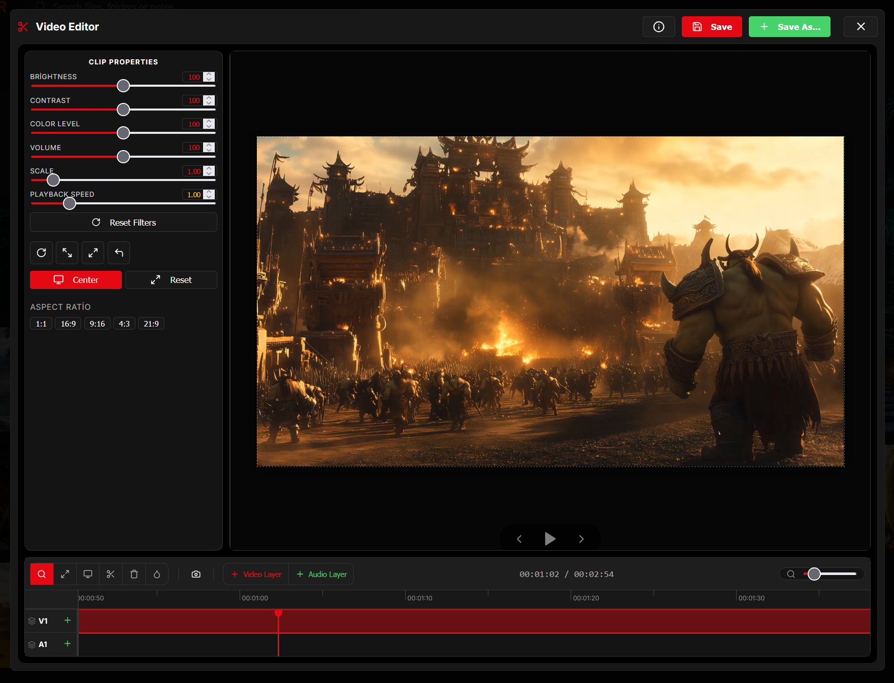

# Gallery Browser & Editor

A high-performance, modern web-based gallery browser with advanced image and video editing capabilities. Inspired by premium streaming interfaces, it provides a seamless experience for managing and processing your local media library.



## 🌟 Key Features

### 📂 Advanced Media Management
- **Folder Navigation:** Easily browse through your local directories.
- **File Operations:** Rename, move, and delete files directly from the interface.
- **Multi-Selection:** Perform batch operations on multiple files simultaneously.
- **Search:** Quickly find media using the powerful search bar.
- **Metadata & Notes:** Add custom notes and view detailed technical information for every file.

### 🖼️ Professional Image Editor
Powerful tools for quick and high-quality image processing.

- **Filters:** Adjust Brightness, Contrast, Saturation, Gamma, and Sharpen.
- **Crop & Resize:** Manual or aspect-ratio locked (1:1, 16:9, etc.) cropping.
- **Canvas Control:** Precise resizing with aspect ratio locking.
- **Transform:** Rotate and flip (Horizontal/Vertical) your images.

### 🎬 Powerful Video Editor
A robust multi-track timeline editor for your video projects.

- **Multi-Track Timeline:** Manage multiple video and audio layers.
- **Clip Manipulation:** Split, trim, move, and reorder clips on the timeline.
- **Live Preview:** Real-time preview of filters and transformations.
- **Video Processing:** Add filters (Brightness, Contrast, Saturation), adjust playback speed, and volume.
- **Transform & Crop:** Rotate, flip, and crop videos with visual guides.
- **Screenshot Tool:** Capture high-quality frames from any video as separate image files.

## 🛠️ System Requirements

- **Operating System:** Windows (optimized with Launcher), macOS, or Linux.
- **Node.js:** v16.x or higher.
- **FFmpeg:** Must be installed and added to the system PATH (required for video editing and metadata extraction).

## 🚀 Installation & Usage

### 1. Requirements
Ensure you have **Node.js** and **FFmpeg** installed on your system.

### 2. Setup
Clone the repository and install dependencies:
```bash
npm install
```

### 3. Configuration
The application uses a `config.ini` file for initial settings. You can also configure these through the **Settings** menu within the app.

### 4. Running the App
You can start both the backend server and the frontend development server with a single command:
```bash
npm start
```
Alternatively, on Windows, you can use the `GalleryLauncher.exe` to start the application easily.

## 🧰 Tech Stack
- **Frontend:** React 18, Vite, Lucide-React, CropperJS.
- **Backend:** Node.js, Express, Better-SQLite3 (for metadata).
- **Processing:** Fluent-FFmpeg.
